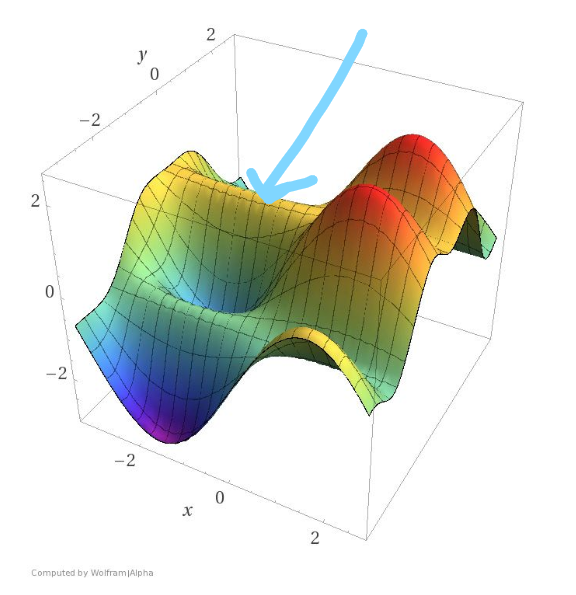

# Training Neural Networks

## Squared Error

When training neural networks we want to produce a solution that works well in "general".

- This means choosing optimal weights based on the training data that minimises the errors.

The Squared Error is usually used as a good determinant of error rate.
$$
E = {1\over{2}}\sum{_i}{(t^{(i)} - y^{(i)})^2}
$$
**The goal is to select our parameter vector theta to produce an error E that is as close to 0 as possible.**

---

## Gradient Descent

In order to find the minimum error rate, E, we can visualise the squared error as a graph. 

If we have a linear neuron, with two inputs w1 and w2 we can visualise the a 3D space with error rate as z, w1 as x, and w2 as y. This would produce a quadratic error surface for a linear neuron. 

 

**Since we can visualize finding the minimum error rate as graph, we can find the smallest Error rate by finding the global minima.** 

1. When initializing the weights of a problem we set the weights we can randomly set weights.

Then:

2. Calculate the direction of **steepest descent**.

3. **Step** towards that direction of the **global minima**.

4. Repeat 2 and 3

---

### Delta Rule and Learning Rates

The learning rate, epsilon, is a hyper parameter, that determines the size of step to take in each iteration of Gradient Descent. 

- The closer to a minima, the less steep the gradient is.
- The further to a minima, the steeper the gradient is.

*The Learning rate is multiplied by the steepness to determine the **Step** size.*

However, if the graph is "mellow" or the learning rate is too small, then training can take a very long time. On the other hand, if the graph is "strong" or the learning rate is too large, then it can be hard to **converge** onto the minima, as it can be overstepped.

At each iteration we want to calculate how to change each weight, this is the **Delta Rule**. 

*Partial Differentiation Equations in relation to the Error rate, Learning rate, neuron inputs are used to find the Delta.* 

---

## Backpropagation Algorithm

Backpropagation is the technique of finding the `error derivatives` of hidden layers, by using the activity and error derivatives of the neurons connected in the layer above.

This is done by accumulating information of how outputs of a neuron in layer `i` (below), affects the logits of all neurons in layer `j` (above).

Dynamic programming is used to produce a table of partial derivatives of the error function with respect to the hidden layers activity, we can determine how to modify hidden weights for gradient descent.

*This is done for all training examples (batches) in the training set.*

### Stochastic and Mini-batch Gradient Descent

When using gradient descent it is possible to run into 'saddle points', these are points of 0 gradient in high-dimensional space.

 

 In order to make gradient descent less sensitive to saddle points we can run gradient descent on a single example in each iteration. This is `Stochastic Gradient Decent (SGD)`, and provides a dynamic error surface for gradient descent to be calculated upon.

However, the error surface provided a Stochastic process may not be sufficient to approximate the overall error surface for Machine Learning. To offset this downside, `Minibatch Gradient Decent` can be used.

Minibatches are small subsets of the larger training set. In each `Epoch` we break down the larger subset into the size of the minibatch and perform Gradient Descent. 

*Minibatches provide a balance between efficiency and local minima avoidance and hence is commonly used.* 

### Overfitting and Test Data

Overfitting can become a major problem in DL models. This is as a machine learning engineer must trade of between overfitting and model complexity.

1. If the model is not complex enough, then all useful information may not be captured.
2. If the model is too complex (and especially if data is limited), then overfitting may occur.
3. There most likely will occur a point in training data, such that useful features are no longer being learnt by the model and instead over fitting occurs.

To prevent overfitting it is important to split the full dataset into training and test data. This allows us to fairly evaluate our model fairly and check against overfitting. 

### Validation Data and Epochs

The training of a network is split over `Epochs`. At the end of each epoch, an additional `Validation Set` is used to validate and check for over training.

- ##### **If the accuracy of the training set increases, whilst the accuracy of the validation set remain constant or decrease, then this is a good sign that overfitting is occurring and that training should stop.**

*The validation data set can also be used to help select the most effective hyperparameters.*
