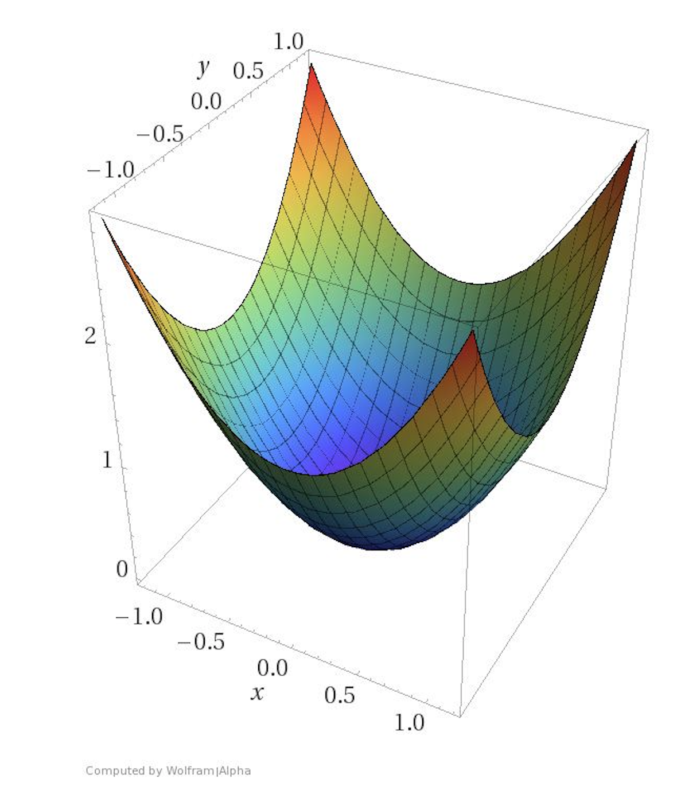

# Training Neural Networks

## Squared Error

When training neural networks we want to produce a solution that works well in "general".

- This means choosing optimal weights based on the training data that minimises the errors.

The Squared Error is usually used as a good determinant of error rate.
$$
E = {1\over{2}}\sum{_i}{(t^{(i)} - y^{(i)})^2}
$$
**The goal is to select our parameter vector theta to produce an error E that is as close to 0 as possible.**

---

## Gradient Descent

In order to find the minimum error rate, E, we can visualise the squared error as a graph. 

If we have a linear neuron, with two inputs w1 and w2 we can visualise the a 3D space with error rate as z, w1 as x, and w2 as y. This would produce a quadratic error surface for a linear neuron. 

 

**Since we can visualise finding the minimum error rate as graph, we can find the smallest Error rate by finding the global minima.** 

1. When initialising the weights of a problem we set the weights we can randomly set weights.

Then:

2. Calculate the direction of **steepest descent**.

3. **Step** towards that direction of the **global minima**.

4. Repeat 2 and 3

---

### Delta Rule and Learning Rates

The learning rate, epsilon, is a hyper parameter, that determines the size of step to take in each iteration of Gradient Descent. 

- The closer to a minima, the less steep the gradient is.
- The further to a minima, the steeper the gradient is.

*The Learning rate is multiplied by the steepness to determine the **Step** size.*

However, if the graph is "mellow" or the learning rate is too small, then training can take a very long time. On the other hand, if the graph is "strong" or the learning rate is too large, then it can be hard to **converge** onto the minima, as it can be overstepped.

At each iteration we want to calculate how to change each weight, this is the **Delta Rule**. 

*(will not be going into the math here, essentially just Partial Differentiation Equations in relation to the Error rate, Learning rate, neuron inputs etc...)*

---

## Back-propagation Algorithm

## Stochastic and Mini-batch Gradient Descent

## Overfitting

